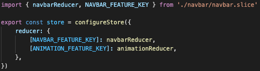

# SOP: Redux

# Redux Toolkit

We are using redux toolkit, an opinionated redux library by the authors of redux.
Its intent is to cut down on boilerplate and provide opinionated patterning.

Its authors encourage typing, but that the extend to which it is used should be validated on a per project basis.

> We strongly recommend using TypeScript in Redux applications. However, like all tools, TypeScript has tradeoffs. It adds complexity in terms of writing additional code, understanding TS syntax, and building the application. At the same time, it provides value by catching errors earlier in development, enabling safer and more efficient refactoring, and acting as documentation for existing source code.

> We believe that pragmatic use of TypeScript provides more than enough value and benefit to justify the added overhead, especially in larger codebases, but you should take time to evaluate the tradeoffs and decide whether it's worth using TS in your own application.

Read more [https://redux.js.org/usage/usage-with-typescript](https://redux.js.org/usage/usage-with-typescript) for common patterning advice.

# Store configuration

The project encapsulates all redux related code in `@rightpoint/website/redux`

`@rightpoint/website/redux` contains the redux store configuration, as well as types for `RootState`.

# Pattern overview

Slices should be defined in a folder called `<slicename>`.

Slices should export an `sliceActions`, `sliceReducers`, and `sliceSelectors` object that can consistently be imported in other files.

If code separation becomes a concern, use file namespaces such as `slice.actions.tsx` and `slice.reducers.tsx`.

# Creating a new slice

-   Copy and paste an existing slice and adjust for your needs
-   Register the slice importing the `<SLICENAME>\_FEATURE_KEY` and `<slice>Reducer`

Example:



# Selectors

Selectors should be exported from the slice file or, if complexity permits or desired, a `slice.selectors.ts` file.

Selectors should always use the officially supported `reselect` memoized selectors via `createSelector`
https://github.com/reduxjs/reselect

This library provides patterns for memoizing, preventing unecessary re-renders, and code organization/chaining.

```javascript
const selectSubtotal = createSelector(selectShopItems, (items) =>
    items.reduce((subtotal, item) => subtotal + item.value, 0)
)

const selectTax = createSelector(
    selectSubtotal,
    selectTaxPercent,
    (subtotal, taxPercent) => subtotal * (taxPercent / 100)
)

const selectTotal = createSelector(
    selectSubtotal,
    selectTax,
    (subtotal, tax) => ({ total: subtotal + tax })
)
```

See how we have calculated, cached properties that can be chained to other selectors. This pattern resolves the redux patterning problem of not having local models with calculated fields.

Selectors should generally be exported as `sliceSelectors` to for consistent importing alongside `sliceActions`, `sliceReducers`, etc.

# Tests

https://redux.js.org/usage/writing-tests

If opting to use jest testing, use integration tests.

-   Hide implementation details.
-   Mock XHR as opposed to mocking a library.
-   Make the testing environment as close to the browser as possible.

On this project, generally speaking, Redux will be tested in the browser as a byproduct of broader integration testing.

If a particularly complex piece of code is being tested, it may be helpful to test it in isolation via jest test on a case-by-case basis.
